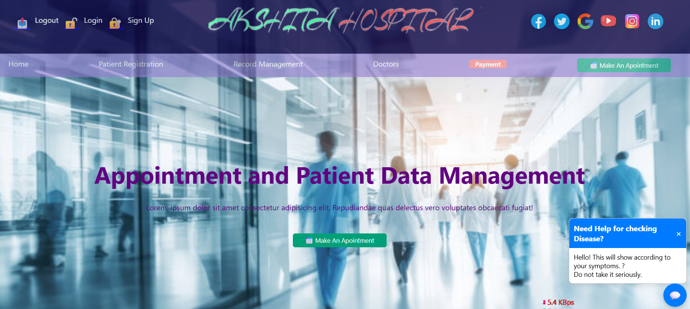

# Project Title
Hospital Clinic Management System

## Introduction
Managing a hospital or clinic isn’t just about treating patients—there’s a lot that goes on behind the scenes. From registering patients and scheduling appointments to maintaining medical records and handling billing, the process can quickly become overwhelming without a proper system in place. With healthcare demand constantly growing, there’s a real need for a more efficient and reliable way to handle everyday operations.
This project, the Hospital/Clinic Management System, is designed to make that process smoother for everyone involved. The main goal is to create a centralized platform where healthcare professionals and administrative staff can easily manage patient information, appointments, billing, prescriptions, and more—all while keeping sensitive data secure and organized.
Some of the key features include secure user login, a complete patient registration process, appointment scheduling based on doctor availability, and digital medical record management. We’ve also added tools like electronic prescriptions, automated appointment reminders, and a patient portal where users can check their records or message their doctors.
To make the system even more helpful, it includes support for multiple languages, works well on different devices (like phones or tablets), and offers a dark mode for easier use at night. There’s even an AI-powered symptom checker in development to help patients get quick insights about their health before visiting the clinic.
In short, this system is all about improving the way clinics and hospitals operate—making things faster, more accurate, and more convenient for both patients and staff.

## Project Type

 Fullstack

## Deplolyed App By Netlify

Full Stack : https://extraordinary-panda-5bdd75.netlify.app/

## Directory Structure
my-app/
├─ backend/
├─ frontend/
│  ├─ ...

## Video Walkthrough of the project

 - (video.mp4) check in file

## Video Walkthrough of the codebase
- (video-2.mp4) check in file

## Features

- User Authentication
Secure login system for doctors, nurses, and administrative staff to ensure that only authorized users can access sensitive data and perform system operations.

- Patient Registration
Allows staff to register new patients by collecting personal details, contact information, and medical history, which is securely stored for future use.

- Appointment Scheduling
Enables patients to book appointments based on doctor availability and allows healthcare professionals to manage and update their schedules.

- Medical Records Management (EMR)
Stores and organizes patients' electronic medical records, making it easy for healthcare providers to access and update patient history during consultations.

- Billing and Invoicing
Tracks medical services provided, generates accurate invoices, and handles payment processing including insurance claim management.

- Patient Portal
A secure online portal where patients can view their medical records, book appointments, request prescription refills, and communicate with their healthcare providers.

- Integrated Prescription Management
Doctors can create, manage, and send electronic prescriptions, while patients can view, track, and request refills with ease.

- Automated Appointment Reminders
Sends SMS or email reminders to patients ahead of their appointments to reduce no-shows and improve clinic efficiency.

- AI-Powered Symptom Checker (Advanced Feature)
Patients can enter their symptoms to receive basic diagnostic suggestions and recommendations on which department or specialist to consult.

- Multi-Language Support
Offers the interface in different languages to accommodate a diverse patient population.

- Inventory Management
Helps staff monitor and manage medical supplies and equipment, issuing alerts when items are low or out of stock.

- Responsive Design
Optimized for use on desktops, tablets, and mobile devices to ensure accessibility anytime, anywhere.

- Dark Mode
Provides a dark theme option for improved user comfort, especially in low-light environments.

## design decisions or assumptions

# Design Decisions
- Modular Architecture
The system is designed using a modular architecture to separate functionalities like authentication, appointments, medical records, and billing. This ensures easier maintenance, scalability, and testing.

- Role-Based Access Control (RBAC)
User roles (e.g., admin, doctor, nurse, patient) are clearly defined, with each role having access only to the features and data necessary for their tasks, to ensure data security and operational clarity.

- Web-Based Interface
The application is web-based to allow access from multiple devices without needing separate installations. This increases accessibility for both staff and patients.

- RESTful API Integration
The backend uses RESTful APIs to ensure separation between the front-end and back-end, improving scalability and enabling future mobile app integration.

- Responsive UI with Accessibility in Mind
The user interface is built using responsive design practices (e.g., Bootstrap or similar framework) to support desktops, tablets, and smartphones.

# Assumptions

- Internet Connectivity
The system assumes consistent internet access for real-time communication, cloud-based data storage, and external notifications.

- Standard Operating Hours
Appointment scheduling and notifications are based on the assumption of standard clinic/hospital operating hours (e.g., 8 AM to 6 PM).

- Digital Literacy
Users (staff and patients) are assumed to have basic digital literacy to navigate the system and use features like online portals and notifications.

- Single Clinic/Hospital Deployment (Initial Scope)
The initial version is designed for a single healthcare facility; multi-location support may be added in future iterations.

- Regulatory Compliance
The system is assumed to follow general healthcare data regulations (e.g., HIPAA-like standards), though customization may be needed for specific countries or regions.

- Device Compatibility
The system is designed to be compatible with modern browsers and devices (e.g., Chrome, Firefox, Edge) and assumes users are not using outdated systems.

## Installation & Getting started

install extension go live server in vs code

run by go live

## Usage

Patient can manage their data  according shown in this manage .

## Credentials
Below are the default user credentials for accessing the authenticated sections of the Hospital/Clinic Management System. These are intended for testing and demonstration purposes.

Admin User
Username/Email: admin@hospital.com

Password: Admin@123

Doctor User
Username/Email: dr.john@hospital.com

Password: Doctor@123

Nurse User
Username/Email: nurse.anna@hospital.com

Password: Nurse@123

Patient User
Username/Email: patient.mike@gmail.com

Password: Patient@123

⚠️ Note: These are sample credentials for demonstration only. In a production environment, all passwords must be encrypted and securely stored.

## APIs Used
 No  external API used

## API Endpoints
Method	Endpoint	Description	Request Example	Response Example
POST	/api/auth/login	Authenticate user and return token	{ "email": "admin@hospital.com", "password": "Admin@123" }	{ "token": "abc123", "role": "admin" }

GET	/api/patients	Retrieve all registered patients	—	[ { "id": 1, "name": "John Doe" }, ... ]
POST	/api/patients	Register a new patient	{ "name": "Jane Smith", "age": 30, "email": "jane@gmail.com" }	{ "message": "Patient created", "id": 10 }

GET	/api/appointments	Get all scheduled appointments	—	[ { "id": 1, "patient": "John Doe", "doctor": "Dr. John" }, ... ]

POST	/api/appointments	Book a new appointment	{ "patientId": 1, "doctorId": 3, "date": "2025-05-12", "time": "10:00" }	{ "message": "Appointment booked successfully" }

## Technology Stack

based only -

- HTML
- CSS
- Javascript